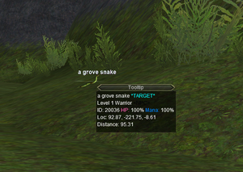
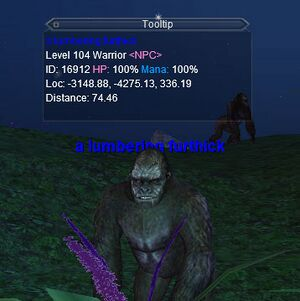

---
tags:
  - plugin
resource_link: "https://www.redguides.com/community/resources/mq2tooltip.199/"
support_link: "https://www.redguides.com/community/threads/mq2tooltip.66895/"
repository: "https://github.com/RedGuides/MQ2ToolTip"
config: "MQ2ToolTip.ini"
authors: "ChatWithThisName (Original Maskoi)"
tagline: "Mouse over any NPC or player to see MQ info about them in the Tooltip window."
---

# MQ2ToolTip

<!--desc-start-->
MQ2ToolTip - Mouse over any NPC or player to see info about them in the Tooltip window. 
<!--desc-end-->
!!! note "Credit to Brainiac for the idea."



## Quick Start
To enable ToolTip ensure the following:

1. Download the latest compile via RedGuides Launcher  
2. Copy the `MQUI_ToolTipWnd.xml` file into your `Next\resources\uifiles\default` folder  
3. Log into Everquest via MQ  
4. Make sure your HUD is on either by hitting the F11 key or by typing `/hud always`  
5. Load the plugin: `/plugin ToolTip`  
6. Reload UI: `/reloadui`  
7. Start ToolTip: `/tooltip on`  
8. When you hover your mouse over an NPC, mob, or yourself you will see the tooltip window pop-up and show MQ information



## Commands

<a href="cmd-tooltip/">

</a>
:     {{ readMore('projects/mq2tooltip/cmd-tooltip.md') }}

## Settings

Config file stored in Next > config folder, as file: MQ2ToolTip.ini

```ini
[Default]
WindowTop=764
WindowLeft=601
WindowRight=793
WindowBottom=881
Locked=0
Fades=1
Delay=2000
Duration=500
Alpha=200
FadeToAlpha=255
BGType=1
BGTint.alpha=255
BGTint.red=0
BGTint.green=0
BGTint.blue=0
FollowMouse=1
Enabled=1
AutoClear=0
ClearTimer=1000
GuildOn=1
```
